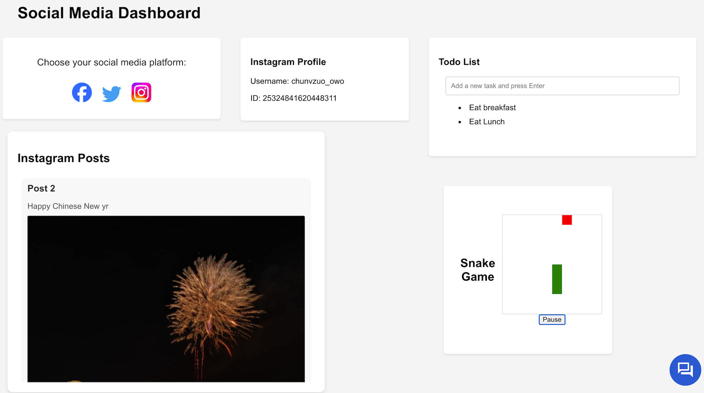
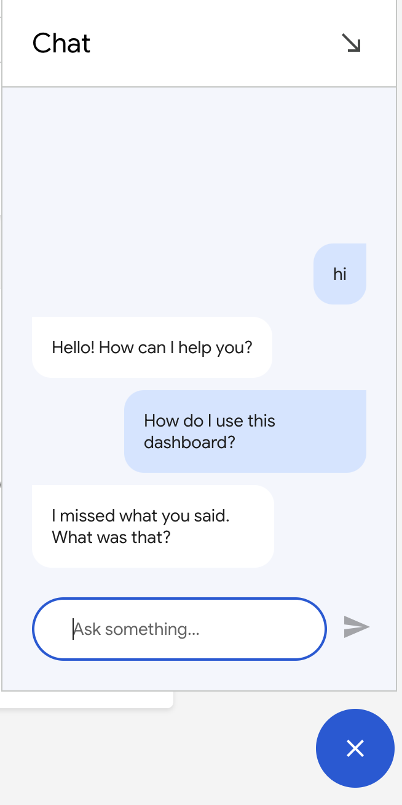

# Social-Media-DashBoard with Integrated Features 

This project is a comprehensive Social Media Dashboard that integrates various social media profiles, posts, a mini-game, a to-do list, and a virtual social media assistant. It's built using React for the frontend and Flask for the backend, providing a rich, interactive user interface for users to engage with their social media content in a unified space.

## Features
- Social Media Integration: View profiles and posts from Facebook, Instagram, and Twitter.
- Mini-Game: A classic snake game integrated within the dashboard for entertainment.
- To-Do List: A simple, interactive to-do list for task management.
- Virtual Social Media Assistant: Powered by Dialogflow, assists users with inquiries and provides interactive communication.

## Installations 
1. Clone repository
```
git clone https://github.com/Pan25245/Social-Media-DashBoard.git
```
2. Set up frontend
Navigate to the frontend directory and install dependencies:

```
cd frontend
npm install
```

Run the frontend server:

```
npm start
```

3. Set up the Backend
Navigate to the backend directory and set up a virtual environment:

```
cd backend
python -m venv venv
```

Activate the virtual environment:
```
On Windows: venv\Scripts\activate
On Unix or MacOS: source venv/bin/activate
```

Install the required packages:
```
pip install -r requirements.txt
```

Run the backend server:
```
flask run
```

## Usage
- Open your browser and navigate to http://localhost:3000 to access the Social Media Dashboard.
- Use the platform selection box to view social media profiles and posts.
- Interact with the to-do list and the snake game as per your interest.
- Communicate with the virtual social media assistant through the chat interface.

## Images 

Dashboard
<br>



<br>
<br>

Chat
<br>


## Pros:
- API Integration: Demonstrated capability in integrating and managing data from multiple social media APIs.
- User Interface: Developed an intuitive UI for easy navigation and interaction with social media content.
- Interactivity: Enabled real-time engagement with content, enhancing user experience.

## Cons and Improvements to make
Token Management:  Currently, the project relies on hardcoded tokens to establish API connections, which serves well for educational purposes. However, a more robust approach would involve implementing a mechanism for dynamically updating these tokens to enhance security and scalability.

Chat Functionality: The existing chat functionality utilizes a pre-set Dialogflow messenger widget, providing a series of predetermined prompts and responses. This serves to showcase fundamental interaction capabilities adequately. Nonetheless, the project aims to evolve towards a more complex chat system that establishes direct communication with the backend. Although an attempt was made to integrate a real-time messaging feature, where messages would be dynamically processed via the backend (dialogflow) to enable tailored user interactions, challenges were encountered, preventing its successful implementation. Future efforts will focus on overcoming these obstacles to achieve a fully interactive and responsive chat experience.


## Conclusion
Through this project, understanding of API integration and UI design was deepned. The challenge of hardcoded tokens was a valuable lesson in the importance of scalable and secure authentication methods for future developments. Further learning is required on google's cloud API. Overall, the project was quite successful.
